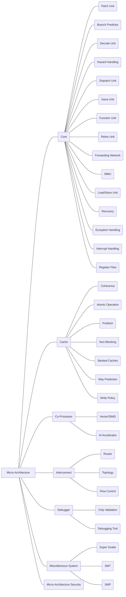

#### **R01 Micro Architecture**

##### *R01A Core; R01B Cache; R01C Co-Processor; R01D Interconnect; R01E Miscellaneous system; R01F Debugger; R01G Microarchitecture Security.*

|                                                              |                 |
| ------------------------------------------------------------ | :-------------: |
| R01A Core;                                                   |                 |
| R01A01 Fetch Unit                                            |  US10372453B2   |
| (1) Fetch Unit is used to fetch instructions from the instruction memory during the Instruction Fetch stage in pipeline.  (2) Instruction prefetching with instruction modification, e.g. store into instruction stream. |
| R01A02 Branch Predictor                                      |  US10318304B2   |
| (1) Branch predictor is used to guess which way a branch (e.g., an if–then–else structure) will go before this is known definitively (to guess the next instruction address). The purpose of the branch predictor is to improve the flow in the instruction pipeline.  (2) Speculative instruction execution using dynamic prediction, e.g. branch history table; Speculative instruction execution using hybrid branch prediction, e.g. selection between prediction techniques; Instruction prefetching for branches, e.g. hedging, branch folding using address prediction, e.g. return stack, branch history buffer. |
| R01A03 Decode Unit                                           |  US10379861B2   |
| (1) During the decode stage, register indexes are identified within the instruction, and the indexes are presented to the register memory, as the address. At the same time the register file is read. If the instruction decoded is a branch or jump, the target address of the branch or jump is computed in parallel with reading the register file.  (2) Parallel decoding, e.g. parallel decode units; Instruction operation extension or modification using decoder, e.g. decoder per instruction set, adaptable or programmable decoders; Decoding for concurrent execution. |
| R01A04 Hazard Handling                                       | US20080082793A1 |
| (1) Harzard Handling is used to handle hazards in pipeline, hazards are problems with the instruction pipeline in CPU microarchitectures when the next instruction cannot execute in the following clock cycle, and can potentially lead to incorrect computation results, three common types of hazards are data hazards, structural hazards, and control hazards (branching hazards). |
| R01A05 Dispatch Unit                                         |   US7035998B1   |
| (1) Task transfer initiation or dispatching by program, e.g. task dispatcher, supervisor, operating system; Scheduling strategies for dispatcher, e.g. round robin, multi-level priority queues; Concurrent instruction execution, e.g. pipeline, look ahead using a plurality of independent parallel functional units; Pipeline control instructions. |
| R01A06 Issue Unit                                            |   US10360038B2  |
| (1) Instruction issuing, e.g. dynamic instruction scheduling, out of order instruction execution from multiple instruction streams, e.g. multistreaming.  (2) Instruction issue logic in this issue stage determines if the pipeline is ready to execute the instruction in this stage. |
| R01A07 Function Unit                                         |   US8024393B2   |
| (1) Arithmetic logic units [ALU], i.e. arrangements or devices for performing two or more of arithmetic operations or for performing logical operations; Adding, Subtraction, Multiplying; Dividing; Computations with numbers represented by a non-linear combination of denominational numbers, e.g. rational numbers, logarithmic number system, floating-point numbers. |
| R01A08 Forwarding Network                                    | US20140281413A1 |
| (1) Forwarding can be generalized to include passing a result directly to the functional unit that requires it: A result is forwarded from the pipeline register corresponding to the output of one unit to the input of another, rather than just from the result of a unit to the input of the same unit; Forwarding logic reduces the effective pipeline latency so that the certain dependences do not result in hazards, e.g., reduce potential data hazard stalls. |
| R01A09 Retire Unit                                           |                 |
| (1) The result of the instruction operation will be written back to the user-visible register/memory according to the original order of the instruction. |
| R01A10 MMU                                                   |  US10185665B2   |
| (1) Protection against unauthorised use of memory or access to memory by checking the object accessibility, e.g. type of access defined by the memory independently of subject rights; Arrangements for executing specific machine instructions to perform operations on memory; Address translation; Free address space management. |
| R01A11 Load/Store Unit                                       |  US10185665B2   |
| (1) Handling requests for load or store for access to memory based on load or store instructions. |
| R01A12 Recovery                                              |  US10185665B2   |
| (1) Recovery, e.g. branch miss-prediction, exception handling, including Roll Back and Snapshot. |
| R01A13 Exception Handling                                    |  US10185665B2   |
| (1) Exception handling is the process of responding to the occurrence of exceptions – anomalous or exceptional conditions requiring special processing – during the execution of a program. Exception handling, if provided, is facilitated by specialized programming language constructs, hardware mechanisms like interrupts, or operating system (OS) inter-process communication (IPC) facilities like signals. Some exceptions, especially hardware ones, may be handled so gracefully that execution can resume where it was interrupted. |
| R01A14 Interrupt Handling                                    |  US10185665B2   |
| (1) Interrupt Handling is a special process associated with a specific interrupt condition. Interrupt handling is initiated by hardware interrupts, software interrupt instructions, or software exceptions, and are used for implementing device drivers or transitions between protected modes of operation, such as system calls.  (2) Means for error signaling, e.g. using interrupts, exception flags, dedicated error registers. |
| R01A15 Register Files                                        |  US10185665B2   |
| (1) A register file is an array of processor registers in a central processing unit (CPU), register files have one word line per entry per port, one bit line per bit of width per read port, and two bit lines per bit of width per write port. Register files may be clubbed together as register banks, and register banking is the method of using a single name to access multiple different physical registers depending on the operating mode. (2) Implementation provisions of register files, e.g. ports; Saving or restoring of program or task context with multiple register sets; Organisation of register space, e.g. banked or distributed register file according to context, e.g. thread buffers. |
| R01B Cache;                                                  |                 |
| R01B01 Coherence                                             |  US10185665B2   |
| (1) Cache coherence is the uniformity of shared resource data that ends up stored in multiple local caches, coherence defines the behavior of reads and writes to a single address location, one type of data occurring simultaneously in different cache memory is called cache coherence, or in some systems, global memory. |
| R01B02 Atomic Operation                                      |  US10185665B2   |
| (1) An atomic operation is a single operation which is not interrupted by other processors during execution on one processor to achieve cache coherence. |
| R01B03 Prefetch                                              |  US10185665B2   |
| (1) Cache prefetching is used by prefetching instructions or data (instruction prefetching and data prefetching) from their original storage in slower memory to a faster local cache memory before it is actually needed, to reduce cache miss penalty or miss rate. |
| R01B04 Non-Blocking                                          |  US10185665B2   |
| (1) A non-blocking cache is used by allowing the cache to continue to supply cache hits during a cache miss, this “hit under miss” optimization reduces the cache miss penalty by overlapping execution with memory access during a cache miss instead of ignoring the requests of the processor. (2) When the processor encounters a long-latency memory access operation, that is, when the request is missing, the missing request is temporarily stored in the missing instruction queue through the cache, and the pipeline is allowed to continue to send subsequent irrelevant requests, hiding the cache missing cost in the processor. In the normal processing of unrelated requests; by reducing the cost of cache misses, the memory access latency is reduced. |
| R01B05 Banked Caches                                         |  US10185665B2   |
| (1) In a banked cache (multibanked cache), the cache is divided into a cache dedicated to instruction storage and a cache dedicated to data that can support simultaneous accesses, to increase cache bandwidth. |
| R01B06 Way prediction                                        |  US10185665B2   |
| (1) Way prediction in set-associative cache, "Way Prediction" refers to tracking the usage of different cache blocks in the same set in the set-associative cache, and then returning the predicted cache blocks without comparison when the access comes, to reduce hit time and conflict misses and yet maintains the hit speed of direct-mapped cache.  (2) In way prediction, extra bits are kept in the cache to predict the way, or block within the set of the next cache access. This prediction means the multiplexor is set early to select the desired block, and only a single tag comparison is performed that clock cycle in parallel with reading the cache data. |
| R01B07 Write Policy                                          |  US10185665B2   |
| (1) There are two policies which define the way in which a modified cache block will be updated in the main memory: write through and write back. In the case of write through policy, whenever the value of the cache block changes, it is further modified in the lower-level memory hierarchy as well. In the case of the write back policy, the changed cache block will be updated in the lower-level hierarchy only when the cache block is evicted.  (2) In a write-through cache, every write to the cache causes a write to main memory. Alternatively, in a write-back or copy-back cache, writes are not immediately mirrored to the main memory, and the cache instead tracks which locations have been written over, marking them as dirty. The data in these locations is written back to the main memory only when that data is evicted from the cache. |
| R01C CoProcessor;                                            |                 |
| R01C01 Vector/SIMD                                           |  US10185665B2   |
| (1) A vector processor (or array processor) is a central processing unit (CPU) that implements an instruction set where its instructions are designed to operate efficiently and effectively on large one-dimensional arrays of data called vectors.  (2) Single instruction, multiple data (SIMD) is a type of simultaneous (parallel) computations, but each unit performs the exact same instruction at any given moment (just with different data). SIMD describes computers with multiple processing elements that perform the same operation on multiple data points simultaneously.  (3) Instructions to perform operations on packed data, e.g. vector operations; Concurrent instruction execution, e.g. pipeline, look ahead using a plurality of independent parallel functional units controlled by a single instruction, e.g. SIMD. |
| R01C02 AI Accelerator                                        |  US10185665B2   |
| (1) An AI accelerator is a class of specialized hardware accelerator or computer system designed to accelerate artificial intelligence and machine learning applications, including artificial neural networks and machine vision. |
| R01D Interconnect                                            |                 |
| R01D01 Router                                                |  US10185665B2   |
| (1) The routing algorithm is used to decide what path a message will take through the network to reach its destination.  (2) Message passing systems or structures, e.g. queues; Queuing arrangements/scheduling; Arrangements for monitoring or testing packet switching networks using dedicated network monitoring probes; Routing or path finding of packets in data switching networks; Channel estimation of multiple channels. |
| R01D02 Topology                                              |  US10185665B2   |
| (1) The on-chip network topology determines the physical layout and connections between nodes and channels in the network. A topology determines the number of hops (or routers) a message must traverse as well as the interconnect lengths between hops. |
| R01D03 Flow Control                                          |  US10185665B2   |
| (1) Flow control governs the allocation of network buffers and links. It determines when buffers and links are assigned to messages, the granularity at which they are allocated, and how these resources are shared among the many messages using the network. |
| R01E Miscellaneous System                                    |                 |
| R01E01 Super Scalar                                          |  US10185665B2   |
| (1) A superscalar processor is a CPU that implements a form of parallelism called instruction-level parallelism within a single processor. In contrast to a scalar processor, which can execute at most one single instruction per clock cycle, a superscalar processor can execute more than one instruction during a clock cycle by simultaneously dispatching multiple instructions to different execution units on the processor. |
| R01E02 SMT                                                   |  US10185665B2   |
| (1) Simultaneous multithreading (SMT) is a technique for improving the overall efficiency of superscalar CPUs with hardware multithreading, which permits multiple independent threads of execution. In simultaneous multithreading, instructions from more than one thread can be executed in any given pipeline stage at a time. |
| R01E03 SMP                                                   |  US10185665B2   |
| (1) Symmetric multiprocessing (SMP, or shared-memory multiprocessing) involves a multiprocessor computer hardware and software architecture where two or more identical processors are connected to a single, shared main memory, have full access to all input and output devices, and are controlled by a single operating system instance that treats all processors equally, reserving none for special purposes. |
| R01F Debugger                                                |                 |
| R01F01 Chip Validation                                       |  US10185665B2   |
| (1) Chip Validation is used to validate electrical aspects of the design, or diagnose systematic manufacturing defects, or perform functional system validation. |
| R01F02 Debugging tool                                        |  US10185665B2   |
| (1) A debugger or debugging tool is a computer program used to finding and resolving bugs (defects or problems that prevent correct operation) within computer programs, software, or systems. Debugging tactics can involve interactive debugging, control flow analysis, unit testing, integration testing, log file analysis, monitoring at the application or system level, memory dumps, and profiling.  (2) Software debugging by tracing the execution of the program; Software debugging using additional hardware using a specific debug interface; Software debugging by tracing the execution of the program tracing values on a bus. |
| R01G Microarchitecture Security                              |  US10185665B2   |
| (1) Protecting specific internal or peripheral components, in which the protection of a component leads to protection of the entire computer by operating on the power supply, e.g. enabling or disabling power-on, sleep or resume operations; Protection against unauthorised use of memory or access to memory by checking the subject access rights using an access-table, e.g. matrix or list;  (2) Detection or location of defective computer hardware by testing during standby operation or during idle time, e.g. start-up testing using arrangements specific to the hardware being tested to test CPU or processors;  (3) Error or fault detection not based on redundancy by exceeding limits by exceeding a count or rate limit, e.g. word- or bit count limit; Error or fault processing not based on redundancy, i.e. by taking additional measures to deal with the error or fault not making use of redundancy in operation, in hardware, or in data representation the processing taking place on a specific hardware platform or in a specific software environment within a central processing unit (CPU). |

