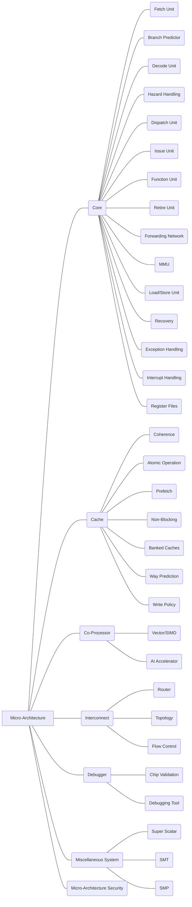

| R02 ISA                                                      |
| ------------------------------------------------------------ |
| R02A Computational INSTs; R02B Control Transfer INSTs; R02C Data Transfer INSTs; R02D Float-Point INSTs; R02E Memory Ordering INSTs; R02F Environment Call & Breakpoints INSTs; R02G HINT INSTs; R02H Atomic INSTs; R02I Control & Status Register (CSR) INSTs; R02J Compressed INSTs; R02K Bit Manipulation INSTs; R02L Language Translated INSTs; R02M Transactional Memory INSTs; R02N Packed-SIMD INSTs; R02O Vector INSTs; R02P Debug INSTs; R02Q Privileged INSTs |
| R02A Computational INSTs                                     |
| R02A01 Arithmetic Operation INSTs                            |
| (1) Add, subtract, multiply, or divide the values of two registers, placing the result in a register, possibly setting one or more condition codes in a status register. |
| R02A02 Logical Operation INSTs                               |
| (1) Perform bitwise operations, e.g., taking the conjunction and disjunction of corresponding bits in a pair of registers, taking the negation of each bit in a register. Compare two values in registers (for example, to see if one is less, or if they are equal) . |
| R02A03 Shift Operation INSTs                                 |
| (1) Shift operation instructions are used to execute Shift Logical operations and Shift Arithmetic operations. |
| R02B Control Transfer INSTs                                  |
| R02B01 Jump & Branch INSTs                                   |
| (1) Jump and branch instructions change the control flow of a program.  (2) Branch to another location in the program and execute instructions there; Conditionally branch to another location if a certain condition holds. |
| R02C Data Transfer INSTs                                     |
| R01C01 Load/Store INSTs                                      |
| (1) Load and store instructions are used to move data between memory and the general registers.  (2) Copy data from a memory location or a register to a memory location or a register, which are used to store the contents of a register, the contents of another memory location or the result of a computation, or to retrieve stored data to perform a computation on it later. |
| R02D Float-Point INSTs                                       |
| R02D01 FP Load/Store INSTs                                   |
| (1) Floating-point instructions extend the CPU instruction set to to perform arithmetic operations on floating-point values (numbers).  (2) FP Load/Store Instructions perform load and store operations on floating-point values (numbers). |
| R02D02 FP Computational INSTs                                |
| (1) FP Computational Instructions perform computing operations on floating-point values (numbers). |
| R02D03 FP Conversion & Move INSTs                            |
| (1) FP Conversion & Move Instructions perform conversion and move operations on floating-point values (numbers). |
| R02D04 FP Compare INSTs                                      |
| (1) FP Compare Instructions perform comparison operations on floating-point values (numbers). |
| R02D05 FP Classify INSTs                                     |
| (1) FP Classify Instructions perform classify operations on floating-point values (numbers). |
| R02E Memory Ordering INSTs                                   |
| (1) The FENCE instruction of Memory Ordering Instructions is used to order device I/O and memory accesses as viewed by other RISC-V harts and external devices or coprocessors. |
| R02F Environment Call & Breakpoints INSTs                    |
| (1) Environment Call and Breakpoints Instructions are used to access system functionality that might require privileged access (allowing simpler implementations to always trap to a single software trap handler), or used to make a service request to the execution environment, or used to return control to a debugging environment. |
| R02G HINT INSTs                                              |
| (1) Hint instructions are usually used to communicate performance hints to the microarchitecture. This HINT encoding has been chosen so that simple implementations can ignore HINTs altogether, and instead execute a HINT as a regular computational instruction that happens not to mutate the architectural state. |
| R02H Atomic INSTs                                            |
| R02H01 Atomic memory Operation INSTs                         |
| (1) The atomic memory operation (AMO) instructions perform read-modify-write operations for multiprocessor synchronization. |
| R02H02 Load reserved/store conditional INSTs (for RVWMO)     |
| (1) The Load reserved/store conditional instructions can be used to build lock-free data structures. |
| R02I Control & Status Register (CSR) INSTs                   |
| (1) CSR instructions are used to atomically read-modify-write a single CSR. |
| R02J Compressed INSTs                                        |
| (1) The compressed instructions are used to reduce static and dynamic code size by adding short 16-bit instruction encodings for common operations. |
| R02K Bit Manipulation INSTs                                  |
| (1) Bit manipulation instructions include instructions to insert, extract, and test bit fields, and for rotations, funnel shifts, and bit and byte permutations. |
| R02L Language Translated INSTs                               |
| (1) Language Translated Instructions are used to support dynamically translated languages. |
| R02M Transactional Memory INSTs                              |
| (1) Transactional Memory Instructions are used to support atomic operations involving multiple addresses by providing a small limited-capacity transactional memory buffer. |
| R02N Packed-SIMD INSTs                                       |
| (1) Packed-SIMD Instructions are used for large floating-point SIMD operations. |
| R02O Vector INSTs                                            |
| (1) The vector instructions are used to provide general support for data-parallel execution within the 32-bit (even more) instruction encoding space. |
| R02P Debug INSTs                                             |
| (1) The debug instructions are used to detect references to a selected physical address, load and store operations to the location. |
| R02Q Privileged INSTs                                        |
| R02Q01 Environment Call & Breakpoint INSTs                   |
| (1) The environment call instruction generates a different exception for each originating privilege mode so that environment call exceptions can be selectively delegated. The breakpoint instruction is used by debuggers to cause control to be transferred back to a debugging environment. It generates a breakpoint exception and performs no other operation.  (2) A breakpoint instruction is used to transfer control to the exception handler immediately and unconditionally when a breakpoint trap occurs. |
| R02Q02 Trap-Return INSTs                                     |
| (1) The trap-return instruction is used to return after handling a trap, there are separate trap return instructions per privilege level. |
| R02Q03 Wait for Interrupt INSTs                              |
| (1) The Wait for Interrupt instruction (WFI) provides a hint to the implementation that the current hart can be stalled until an interrupt might need servicing. Execution of the WFI instruction can also be used to inform the hardware platform that suitable interrupts should preferentially be routed to this hart. The purpose of the WFI instruction is to provide a hint to the implementation, and so a legal implementation is to simply implement WFI as a NOP. |
| R02Q04 Custom SYSTEM INSTs                                   |
| (1) The Custom SYSTEM Instruction is designated for custom use to designate the minimum required privilege mode. |
| R02Q05 Supervisor INSTs                                      |
| (1) The Supervisor Instruction includes Supervisor Memory-Management Fence Instruction, which is used to synchronize updates to in-memory memory-management data structures with current execution. |
| R02Q06 Hypervisor INSTs                                      |
| (1) The Hypervisor Instructions include Hypervisor Virtual-Machine Load and Store Instructions and Hypervisor Memory-Management Fence Instructions. |
| R02Q07 Exception INSTs (e.g., Trap INSTs)                    |
| (1) Exception instructions cause a branch to the general exception handling vector based upon the result of a comparison.  (2) A trap instruction is used to handle a trap exception. |