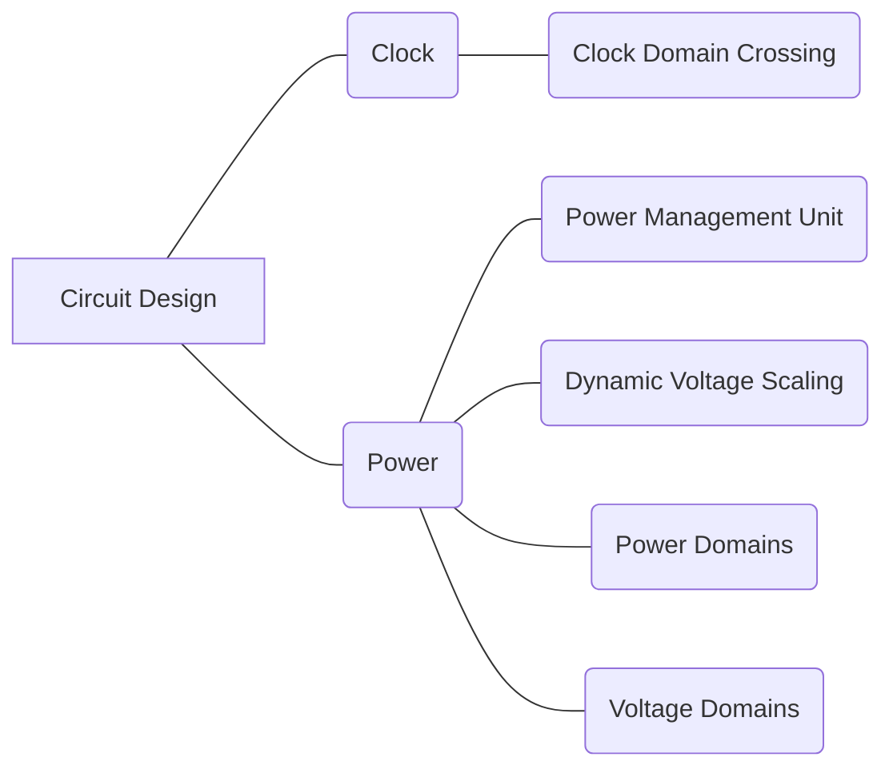

#### **R04 Circuit Design**

##### *R04A Clock; R04B Power.

|                                                              |
| ------------------------------------------------------------ |
| R04A Clock;                                                  |
| R04A01 Clock Domain Crossing                                 |
| In digital electronic design a clock domain crossing (CDC), or simply clock crossing, is the traversal of a signal in a synchronous digital circuit from one clock domain into another. |
| R04B Power;                                                  |
| R04B01 Power Management Unit                                 |
| Power management integrated circuits (power management ICs or PMICs or PMU as unit) are integrated circuits for power management. |
| R04B02 Dynamic Voltage Scaling                               |
| Dynamic voltage scaling is a power management technique in computer architecture, where the voltage used in a component is increased or decreased, depending upon circumstances. Dynamic voltage scaling to increase voltage is known as overvolting; dynamic voltage scaling to decrease voltage is known as under-volting. |
| R04B03 Power Domains                                         |
| To meet the challenge of low power consumption, the SoC is usually divided into multiple power domains. Different power domains can be powered on and off independently. |
| R04B04 Voltage Domains                                       |
| Multi-voltage domain design divides the logic inside the chip into multiple parts, and each part is powered by its corresponding power supply voltage. |
