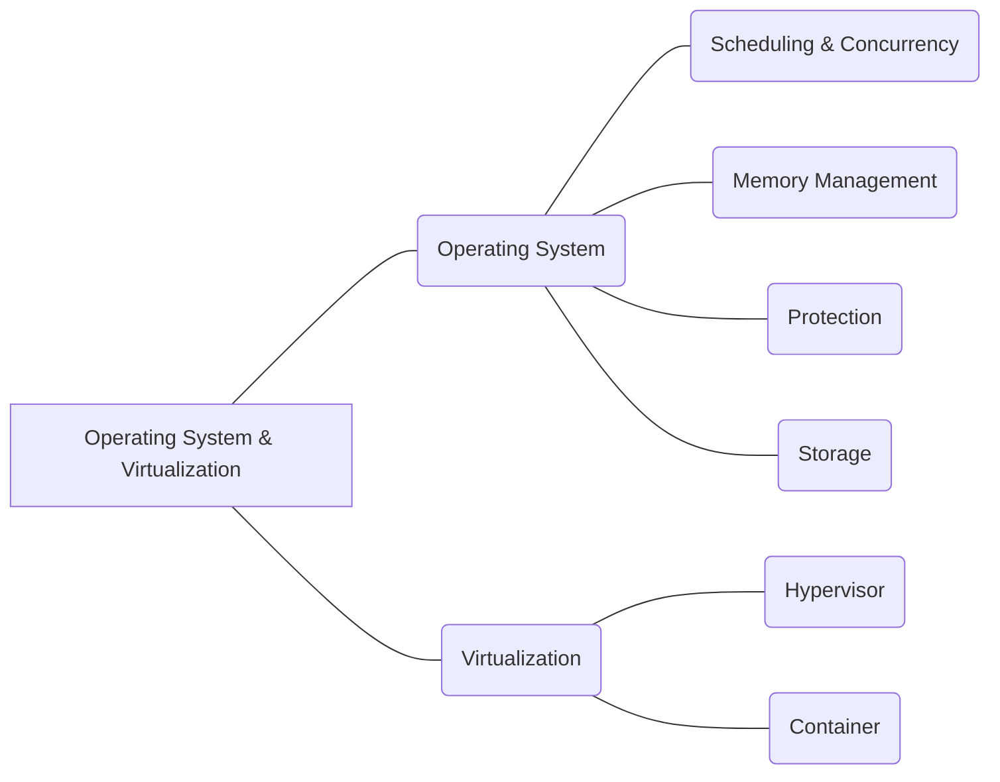

#### **R03 Operating System & Virtualization**

##### *R03A Operating System; R03B Virtualization.*

|                                                              |
| ------------------------------------------------------------ |
| R03A Operating System;                                       |
| R03A01 Scheduling & Concurrency                              |
| Scheduling is the action of assigning resources to perform tasks. The resources may be processors, network links or expansion cards. The tasks may be threads, processes or data flows. The scheduling activity is carried out by a process called scheduler. Schedulers are often designed so as to keep all computer resources busy (as in load balancing), allow multiple users to share system resources effectively, or to achieve a target quality-of-service. --https://en.wikipedia.org/wiki/Scheduling_(computing) Allocation of resources, e.g. of the central processing unit (CPU) to service a request the resources being hardware resources other than CPUs, Servers and Terminals the resource being the memory. - [CPC Explanations] Concurrent instruction execution, e.g. pipeline, look ahead using a plurality of independent parallel functional units. - [CPC Explanations] |
| R03A02 Memory Management                                     |
| In operating systems, memory management is the function responsible for managing the computer's primary memory. The memory management function keeps track of the status of each memory location, either allocated or free. It determines how memory is allocated among competing processes, deciding which gets memory, when they receive it, and how much they are allowed. When memory is allocated, it determines which memory locations will be assigned. It tracks when memory is freed or unallocated and updates the status. This is distinct from application memory management, which is how a process manages the memory assigned to it by the operating system. --https://en.wikipedia.org/wiki/Memory_management_(operating_systems) |
| R03A03 Protection                                            |
| Security in an OS is a very important issue. It not only includes security from outside threats, such as viruses and hacking, but internal security as well. For example, the OS is responsible for making sure that processes don't access memory outside of their own address space. If a program does so, it must be shutdown to protect other 'well behaved' programs. Operating system security can be divided into two basic categories, high-level and low-level security. --https://wiki.osdev.org/Security |
| R03A04 Storage                                               |
| Access to data stored on disks is a central feature of all operating systems. Computers store data on disks using files, which are structured in specific ways in order to allow for faster access, higher reliability, and to make better use of the drive's available space. The specific way in which files are stored on a disk is called a file system, and enables files to have names and attributes. It also allows them to be stored in a hierarchy of directories or folders arranged in a directory tree. --https://en.wikipedia.org/wiki/Operating_system#Disk_access_and_file_systems |
| R03B Virtualization;                                         |
| R03B01 Hypervisor                                            |
| A hypervisor is similar to an emulator; it is computer software, firmware or hardware that creates and runs virtual machines. A computer on which a hypervisor runs one or more virtual machines is called a host machine, and each virtual machine is called a guest machine. The hypervisor presents the guest operating systems with a virtual operating platform and manages the execution of the guest operating systems. Multiple instances of a variety of operating systems may share the virtualized hardware resources. This contrasts with operating-system–level virtualization, where all instances (usually called containers) must share a single kernel, though the guest operating systems can differ in user space, such as different Linux distributions with the same kernel. --https://en.wikipedia.org/wiki/Hypervisor                                                                                                                                                                                          Emulation; Interpretation; Software simulation, e.g.   virtualisation or emulation of application or operating system execution engines. -[CPC Explanations] Hypervisors; Virtual machine monitors.  -[CPC Explanations] |
| R01B02 Container                                             |
| (OS-level virtualization is an operating system (OS) paradigm in which the kernel allows the existence of multiple isolated user space instances, called containers, zones, virtual private servers, partitions, virtual environments, virtual kernels, or jails. Such instances may look like real computers from the point of view of programs running in them. --https://en.wikipedia.org/wiki/OS-level_virtualization |
