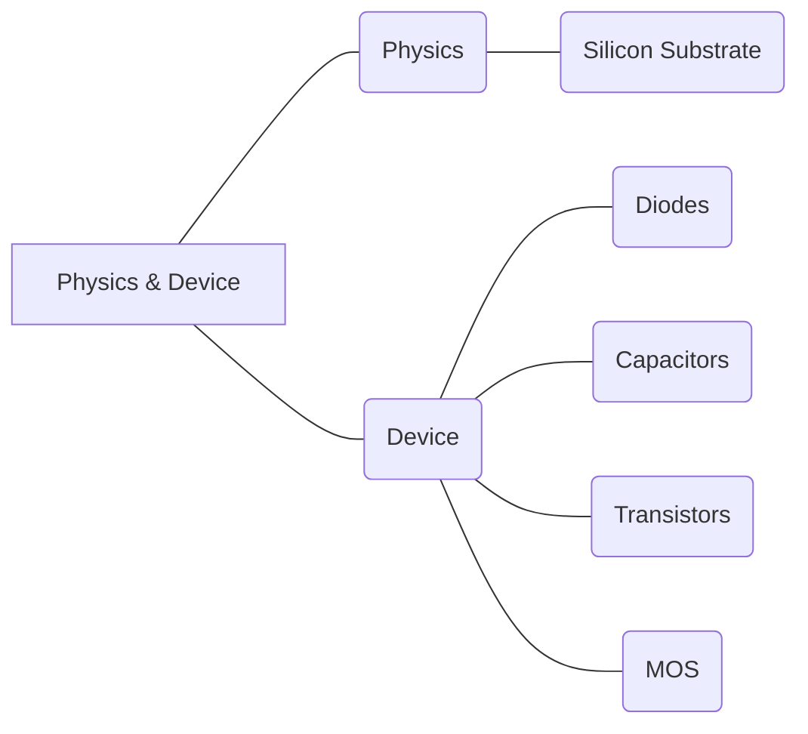

#### **R05 Physics & Device**

##### *R05A Physics; R05B Device.

|                                                              |
| ------------------------------------------------------------ |
| R05A Physics;                                                |
| R05A01 Silicon Substrate                                     |
| In electronics, a substrate (also called a slice or wafer) is a thin slice of semiconductor, such as a crystalline silicon (c-Si), used for the fabrication of integrated circuits. - [https://en.wikipedia.org/wiki/Wafer_(electronics)] |
| R05B Device;                                                 |
| R05B01 Diodes                                                |
| A diode is a two-terminal electronic component that conducts current primarily in one direction (asymmetric conductance); it has low (ideally zero) resistance in one direction, and high (ideally infinite) resistance in the other. - [https://en.wikipedia.org/wiki/Diode] |
| R05B02 Capacitors                                            |
| A capacitor is a device that stores electrical energy in an electric field. It is a passive electronic component with two terminals. - [https://en.wikipedia.org/wiki/Capacitor] |
| R05B03 Transistors                                           |
| A transistor is a semiconductor device used to amplify or switch electrical signals and power. It is composed of semiconductor material, usually with at least three terminals for connection to an electronic circuit. - [https://en.wikipedia.org/wiki/Transistor] |
| R05B04 Voltage MOS                                           |
| The metal–oxide–semiconductor field-effect transistor (MOSFET, MOS-FET, or MOS FET), also known as the metal–oxide–silicon transistor (MOS transistor, or MOS), is a type of insulated-gate field-effect transistor that is fabricated by the controlled oxidation of a semiconductor, typically silicon. - [https://en.wikipedia.org/wiki/MOSFET] |
