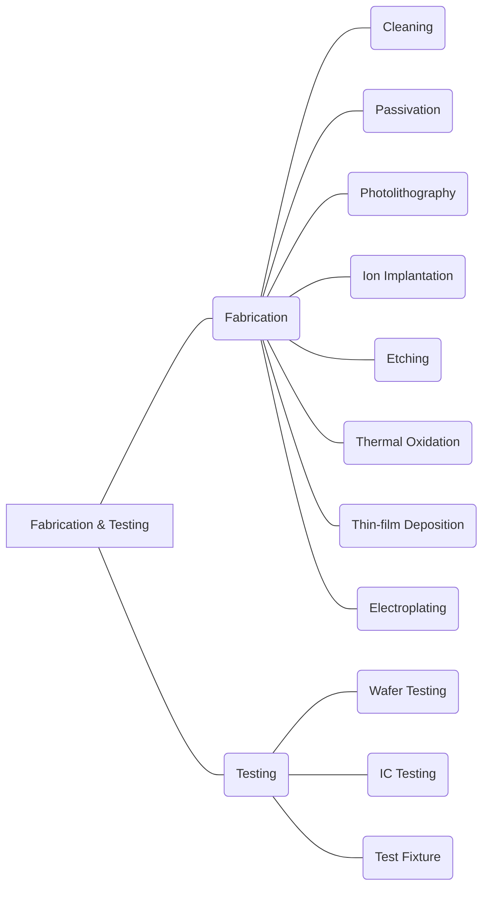

#### **R06 Fabrication & Testing**

##### *R06A Fabrication; R06B Testing.

|                                                              |
| ------------------------------------------------------------ |
| R06A Fabrication;                                            |
| R06A01 Cleaning                                              |
| The cleaning operation is a standard set of wafer cleaning steps which may include removal of the organic contaminants (organic clean + particle clean), removal of thin oxide layer (oxide strip, optional), and removal of ionic contamination (ionic clean). - [https://en.wikipedia.org/wiki/RCA_clean] |
| R06A02 Passivation                                           |
| Passivation refers to coating a material so it becomes "passive," that is, less readily affected or corroded by the environment. Passivation involves creation of an outer layer of shield material that is applied as a microcoating, created by chemical reaction with the base material, or allowed to build by spontaneous oxidation in the air. As a technique, passivation is the use of a light coat of a protective material, such as metal oxide, to create a shield against corrosion. - [https://en.wikipedia.org/wiki/Semiconductor_device_fabrication] & [https://en.wikipedia.org/wiki/Passivation_(chemistry)] |
| R06A03 Photolithography                                      |
| Photolithography or optical lithography is a general term used for techniques that use light to produce minutely patterned thin films of suitable materials over a substrate, such as a silicon wafer, to protect selected areas of it during subsequent etching, deposition, or implantation operations. - [https://en.wikipedia.org/wiki/Photolithography] |
| R06A04 Ion Implantation                                      |
| Ion implantation is a low-temperature process by which ions of one element are accelerated into a solid target, thereby changing the physical, chemical, or electrical properties of the target. - [https://en.wikipedia.org/wiki/Ion_implantation] |
| R06A05 Etching                                               |
| Etching is used in microfabrication to chemically remove layers from the surface of a wafer during manufacturing. - [https://en.wikipedia.org/wiki/Etching_(microfabrication)] |
| R06A06 Thermal Oxidation                                     |
| In microfabrication, thermal oxidation is a way to produce a thin layer of oxide (usually silicon dioxide) on the surface of a wafer. The technique forces an oxidizing agent to diffuse into the wafer at high temperature and react with it. - [https://en.wikipedia.org/wiki/Thermal_oxidation] & [https://en.wikipedia.org/wiki/Semiconductor_device_fabrication] |
| R06A07 Thin-film deposition                                  |
| The thin-film deposition technology may include Chemical vapor deposition (CVD) and Physical vapor deposition (PVD), which are used in the semiconductor industry to produce thin films. - [https://en.wikipedia.org/wiki/Chemical_vapor_deposition] & [https://en.wikipedia.org/wiki/Physical_vapor_deposition] |
| R06A08 Electroplating                                        |
| Electroplating is a general name for processes that produce a metal coating on a solid substrate through the reduction of cations of that metal by means of a direct electric current. - [https://en.wikipedia.org/wiki/Electroplating] |
| R06B Testing;                                                |
| R06B01 Wafer Testing                                         |
| Wafer testing is a step performed during semiconductor device fabrication. During this step, performed before a wafer is sent to die preparation, all individual integrated circuits that are present on the wafer are tested for functional defects by applying special test patterns to them. - [https://en.wikipedia.org/wiki/Wafer_testing] |
| R06B02 IC Testing                                            |
| Once the front-end process has been completed, the semiconductor devices or chips are subjected to a variety of electrical tests to determine if they function properly. Chips are also tested again after packaging, as the bond wires may be missing, or analog performance may be altered by the package. This is referred to as the "final test". - [https://en.wikipedia.org/wiki/Semiconductor_device_fabrication#Device_test] |
| R06B03 Test Fixture                                          |
| A test fixture is a piece of test equipment used to test wafer or integrated circuits (e.g., wafer prober). |
