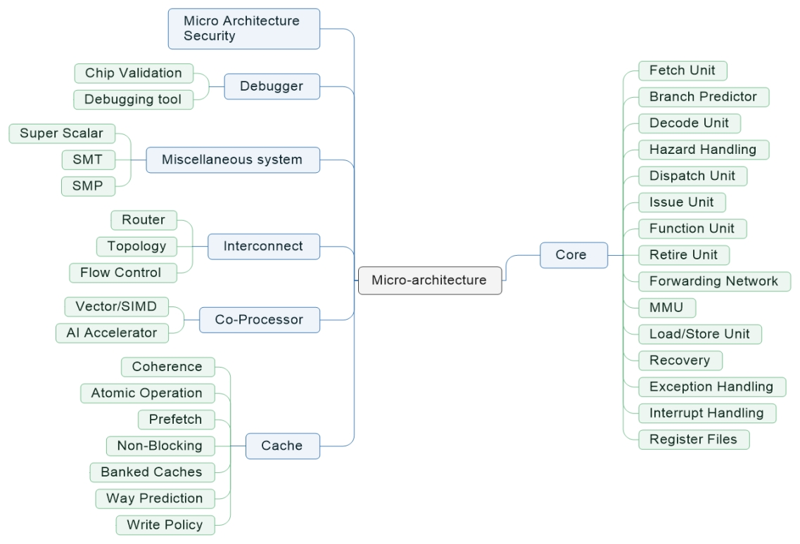

| R01 Micro Architecture   |                                                              |                 |
| ------------------------------------------------------------ | ------------------------------------------------------------ | --------------- |
| R01A Core; R01B Cache; R01C CoProcessor; R01D Interconnect; R01E Miscellaneous system; R01F Debugger; R01G Microarchitecture Security. |                                                              |                 |
| R01A Core;                                                   |                                                              |                 |
| R01A01 Fetch Unit                                            |                                                              | US10372453B2    |
| (1) Fetch Unit is used to fetch instructions from the instruction memory during the Instruction Fetch stage in pipeline.  (2) Instruction prefetching with instruction modification, e.g. store into instruction stream. | (1) 取指令单元用于在流水线的取指令阶段从指令内存中取指令。- [https://en.wikipedia.org/wiki/Classic_RISC_pipeline] (2) 附带指令修改的指令预取，例如存储到指令流中。 |                 |
| R01A02 Branch Predictor                                      |                                                              | US10318304B2    |
| (1) Branch predictor is used to guess which way a branch (e.g., an if–then–else structure) will go before this is known definitively (to guess the next instruction address). The purpose of the branch predictor is to improve the flow in the instruction pipeline.  (2) Speculative instruction execution using dynamic prediction, e.g. branch history table; Speculative instruction execution using hybrid branch prediction, e.g. selection between prediction techniques; Instruction prefetching for branches, e.g. hedging, branch folding using address prediction, e.g. return stack, branch history buffer. | (1) 分支预测器用于猜测一个分支(例如，一个if-then-else结构)在确定已知之前的走向(猜测下一个指令地址)。分支预测器的目的是改善指令流水线中的流程。 (2) 使用动态预测的推测指令执行，例如分支历史表；使用混合分支预测的推测指令执行，例如在预测技术之间的选择；分支的指令预取，例如hedging，使用地址预测的分支消除(branch folding)，例如返回堆栈，分支历史缓冲区。 |                 |
| R01A03 Decode Unit                                           |                                                              | US10379861B2    |
| (1) During the decode stage, register indexes are identified within the instruction, and the indexes are presented to the register memory, as the address. At the same time the register file is read. If the instruction decoded is a branch or jump, the target address of the branch or jump is computed in parallel with reading the register file.  (2) Parallel decoding, e.g. parallel decode units; Instruction operation extension or modification using decoder, e.g. decoder per instruction set, adaptable or programmable decoders; Decoding for concurrent execution. | (1) 在解码阶段，在指令中识别寄存器索引，并将索引作为地址提交给寄存器内存。同时读取寄存器文件。如果解码的指令是一个分支或跳转，则读取寄存器文件的同时计算分支或跳转的目标地址。 (2) 并行解码，例如并行解码单元；使用解码器的指令操作扩展或修改，例如每个指令集的解码器、可适配或可编程解码器；为并发执行解码。 |                 |
| R01A04 Hazard Handling                                       |                                                              | US20080082793A1 |
| (1) Harzard Handling is used to handle hazards in pipeline, hazards are problems with the instruction pipeline in CPU microarchitectures when the next instruction cannot execute in the following clock cycle, and can potentially lead to incorrect computation results, three common types of hazards are data hazards, structural hazards, and control hazards (branching hazards). | (1) 冲突处理用于处理流水线中的冲突，冲突是CPU微架构中的指令流水线问题，当下一条指令不能在下一个时钟周期中执行时，可能会导致不正确的计算结果，三种常见的冲突类型是数据冲突，结构冲突，控制冲突(分支冲突)。 |                 |
| R01A05 Dispatch Unit                                         |                                                              | US7035998B1     |
| (1) Task transfer initiation or dispatching by program, e.g. task dispatcher, supervisor, operating system; Scheduling strategies for dispatcher, e.g. round robin, multi-level priority queues; Concurrent instruction execution, e.g. pipeline, look ahead using a plurality of independent parallel functional units; Pipeline control instructions. | (1) 通过程序发起或分发任务，例如任务分发器、监管、操作系统；分发器的调度策略，如轮询，多级优先级队列；并行指令执行，例如流水线、使用多个独立的并行功能单元提前执行指令；流水线控制指令。 |                 |
| R01A06 Issue Unit                                            |                                                              | US10360038B2    |
| (1) Instruction issuing, e.g. dynamic instruction scheduling, out of order instruction execution from multiple instruction streams, e.g. multistreaming.  (2) Instruction issue logic in this issue stage determines if the pipeline is ready to execute the instruction in this stage. | (1) 指令发送，如动态指令调度，多指令流的乱序指令执行，如multistreaming。 (2) 发送阶段的指令发送逻辑决定了流水线是否准备好执行这个阶段的指令。 |                 |
| R01A07 Function Unit                                         |                                                              | US8024393B2     |
| (1) Arithmetic logic units [ALU], i.e. arrangements or devices for performing two or more of arithmetic operations or for performing logical operations; Adding, Subtraction, Multiplying; Dividing; Computations with numbers represented by a non-linear combination of denominational numbers, e.g. rational numbers, logarithmic number system, floating-point numbers. | (1) 算术逻辑单元(ALU)，即执行两个或多个算术运算或执行逻辑运算的装置或部署；加法、减法、乘法、除法；用非线性组合的数制表示的数字计算，例如有理数、对数数制、浮点数。 |                 |
| R01A08 Forwarding Network                                    |                                                              | US20140281413A1 |
| (1) Forwarding can be generalized to include passing a result directly to the functional unit that requires it: A result is forwarded from the pipeline register corresponding to the output of one unit to the input of another, rather than just from the result of a unit to the input of the same unit; Forwarding logic reduces the effective pipeline latency so that the certain dependences do not result in hazards, e.g., reduce potential data hazard stalls. | (1) 前插(Forwarding)可以概况为将功能单元需要的结果直接传送至功能单元：结果从对应于一个单元输出端的流水线寄存器，前插至另一单元输入端，而不是将一个单元的输出结果传送至相同单元的输入端；前插逻辑减少了有效的流水线延迟，因此某些依赖关系不会导致冲突，例如，减少潜在的数据冲突停顿。 |                 |
| R01A09 Retire Unit                                           |                                                              |                 |
| (1) The result of the instruction operation will be written back to the user-visible register/memory according to the original order of the instruction. | (1) 指令操作的结果将按照指令的原始顺序写回用户可见寄存器/内存。 |                 |
| R01A10 MMU                                                   |                                                              | US10185665B2    |
| (1) Protection against unauthorised use of memory or access to memory by checking the object accessibility, e.g. type of access defined by the memory independently of subject rights; Arrangements for executing specific machine instructions to perform operations on memory; Address translation; Free address space management. | (1) 通过检查对象的可访问性，防止未经授权使用内存或访问内存，例如与对象权利无关的内存访问类型；执行特定机器指令以在内存上执行操作的部署；地址转换；空闲地址空间管理。 |                 |
| R01A11 Load/Store Unit                                       |                                                              | US10268481B2    |
| (1) Handling requests for load or store for access to memory based on load or store instructions. | (1) 根据加载或存储指令，处理加载或存储请求以访问内存。       |                 |
| R01A12 Recovery                                              |                                                              |                 |
| (1) Recovery, e.g. branch miss-prediction, exception handling, including Roll Back and Snapshot. | (1) 恢复，例如分支错误预测，异常处理，包括回滚(Roll Back)和快照(Snapshot)。 |                 |
| R01A13 Exception Handling                                    |                                                              | US10423417B2    |
| (1) Exception handling is the process of responding to the occurrence of exceptions – anomalous or exceptional conditions requiring special processing – during the execution of a program. Exception handling, if provided, is facilitated by specialized programming language constructs, hardware mechanisms like interrupts, or operating system (OS) inter-process communication (IPC) facilities like signals. Some exceptions, especially hardware ones, may be handled so gracefully that execution can resume where it was interrupted. | (1) 异常处理是在程序执行过程中对异常(需要特殊处理的异常或异常条件)的发生作出响应的过程。如果提供了异常处理，则通过专门的编程语言构造、硬件机制(如中断)或操作系统进程间通信(IPC)设施(如信号)来促进异常处理。一些异常，特别是硬件异常，可以被很好地处理，从而可以在中断的地方恢复执行。 |                 |
| R01A14 Interrupt Handling                                    |                                                              | US20130159578A1 |
| (1) Interrupt Handling is a special process associated with a specific interrupt condition. Interrupt handling is initiated by hardware interrupts, software interrupt instructions, or software exceptions, and are used for implementing device drivers or transitions between protected modes of operation, such as system calls.  (2) Means for error signaling, e.g. using interrupts, exception flags, dedicated error registers. | (1) 中断处理是一个与特定中断条件相关联的特殊进程。中断处理由硬件中断、软件中断指令或软件异常发起，并用于实现设备驱动程序或在受保护的操作模式(如系统调用)之间的转换。 (2) 用于错误信号的处理方式，例如使用中断、异常标志、专用错误寄存器。 |                 |
| R01A15 Register Files                                        |                                                              | US9304934B2     |
| (1) A register file is an array of processor registers in a central processing unit (CPU), register files have one word line per entry per port, one bit line per bit of width per read port, and two bit lines per bit of width per write port. Register files may be clubbed together as register banks, and register banking is the method of using a single name to access multiple different physical registers depending on the operating mode. (2) Implementation provisions of register files, e.g. ports; Saving or restoring of program or task context with multiple register sets; Organisation of register space, e.g. banked or distributed register file according to context, e.g. thread buffers. | (1) 寄存器文件是中央处理器(CPU)中的处理器寄存器数组，寄存器文件每个端口每个条目有一个字行，每个读端口每个宽度有一个位行，每个写端口每个宽度有两个位行。寄存器文件可以作为寄存器分块(register banks)组合在一起，寄存器分块是根据操作模式使用单一名称访问多个不同物理寄存器的方法。 (2) 执行寄存器文件的规定，例如端口；用多个寄存器集保存或恢复程序或任务上下文；寄存器空间的组织，例如，根据上下文存储或分布寄存器文件，例如线程缓冲区。 |                 |
| R01B Cache;                                                  |                                                              |                 |
| R01B01 Coherence                                             |                                                              | US8234455B2     |
| (1) Cache coherence is the uniformity of shared resource data that ends up stored in multiple local caches, coherence defines the behavior of reads and writes to a single address location, one type of data occurring simultaneously in different cache memory is called cache coherence, or in some systems, global memory. | (1) 缓存一致性是存储在多个本地缓存的共享资源数据的一致性，一致性定义读和写一个单一地址位置的行为，一个类型的数据同时出现在不同的缓存、或出现在某些系统和全局内存中，被称为缓存一致性。 |                 |
| R01B02 Atomic Operation                                      |                                                              | US7257814B1     |
| (1) An atomic operation is a single operation which is not interrupted by other processors during execution on one processor to achieve cache coherence. | (1) 原子操作是在一个处理器上执行时不被其他处理器中断的单个操作，以实现缓存一致性。 |                 |
| R01B03 Prefetch                                              |                                                              | US7194582B1     |
| (1) Cache prefetching is used by prefetching instructions or data (instruction prefetching and data prefetching) from their original storage in slower memory to a faster local cache memory before it is actually needed, to reduce cache miss penalty or miss rate. | (1) 缓存预取是在实际需要之前，将指令或数据(指令预取和数据预取)从较慢内存中的原始存储预取到较快的本地缓存中，以减少缓存缺失的损失或缺失率。 |                 |
| R01B04 Non-Blocking                                          |                                                              |                 |
| (1) A non-blocking cache is used by allowing the cache to continue to supply cache hits during a cache miss, this “hit under miss” optimization reduces the cache miss penalty by overlapping execution with memory access during a cache miss instead of ignoring the requests of the processor. (2) When the processor encounters a long-latency memory access operation, that is, when the request is missing, the missing request is temporarily stored in the missing instruction queue through the cache, and the pipeline is allowed to continue to send subsequent irrelevant requests, hiding the cache missing cost in the processor. In the normal processing of unrelated requests; by reducing the cost of cache misses, the memory access latency is reduced. | (1) 非阻塞缓存是指允许缓存在缓存缺失时继续提供缓存命中来使用，这种“hit under miss”优化通过在缓存缺失时重叠执行内存访问，而不是忽略处理器的请求，以减少缓存缺失的损失。 (2) 当处理器遇到一个长时延内存访问操作时，即当请求丢失时，丢失的请求通过缓存临时存储在丢失的指令队列中，并且流水线被允许继续发送后续的无关请求，将缓存缺失的代价隐藏在处理器中。在正常处理不相关请求时，通过减少缓存缺失的代价，内存访问时延就减少了。 |                 |
| R01B05 Banked Caches                                         |                                                              | US5307477A      |
| (1) In a banked cache (multibanked cache), the cache is divided into a cache dedicated to instruction storage and a cache dedicated to data that can support simultaneous accesses, to increase cache bandwidth. | (1) 在区块化缓存(多区块缓存，multibanked cache)中，缓存被分为一个专用于指令存储的缓存和一个专用于数据存储的缓存，两个缓存支持同时访问，以增加缓存带宽。 |                 |
| R01B06 Way prediction                                        |                                                              | US8392651B2     |
| (1) Way prediction in set-associative cache, "Way Prediction" refers to tracking the usage of different cache blocks in the same set in the set-associative cache, and then returning the predicted cache blocks without comparison when the access comes, to reduce hit time and conflict misses and yet maintains the hit speed of direct-mapped cache.  (2) In way prediction, extra bits are kept in the cache to predict the way, or block within the set of the next cache access. This prediction means the multiplexor is set early to select the desired block, and only a single tag comparison is performed that clock cycle in parallel with reading the cache data. | (1) 缓存预测是指组相连(set-associative)缓存中的路预测(Way prediction)，“路预测”是指跟踪组相连缓存中同一组内不同缓存区块的使用情形，当出现缓存访问时，不用执行比较操作返回预测的缓存区块，以减少命中时间和冲突损失，并且能维持直接映射缓存的命中速度。 (2) 在路预测中，额外的位被保存在缓存中以预测下一个缓存访问的组内位置或区块。这种预测意味着多路复用器(multiplexor)被提前设置以选择所需的区块，并且在读取缓存数据同一时钟周期内，只执行一次单独的标签比较操作。 |                 |
| R01B07 Write Policy                                          |                                                              | US7562191B22    |
| (1) There are two policies which define the way in which a modified cache block will be updated in the main memory: write through and write back. In the case of write through policy, whenever the value of the cache block changes, it is further modified in the lower-level memory hierarchy as well. In the case of the write back policy, the changed cache block will be updated in the lower-level hierarchy only when the cache block is evicted.  (2) In a write-through cache, every write to the cache causes a write to main memory. Alternatively, in a write-back or copy-back cache, writes are not immediately mirrored to the main memory, and the cache instead tracks which locations have been written over, marking them as dirty. The data in these locations is written back to the main memory only when that data is evicted from the cache. | (1) 有两种策略定义了修改后的缓存块在主存中更新的方式：写直达(write through)和写回(write back)。在写直达策略的情形下，每当缓存块的值改变时，它也会在较低级别的内存层次结构中被进一步修改。对于写回策略，修改后的缓存块只有在被替换时才会被更新到较低级别的内存层次结构中。 (2) 在写直达缓存中，每次对缓存的写都会导致对主存的写。相反，在写回或复制缓存中，写操作不会立即镜像到主存，而是由缓存跟踪哪些位置已经被写过，并将它们标记为dirty。只有当这些数据从缓存中被替换时，这些位置中的数据才会被写回主内存。 |                 |
| R01C CoProcessor;                                            |                                                              |                 |
| R01C01 Vector/SIMD                                           |                                                              | US20130159667A1 |
| (1) A vector processor (or array processor) is a central processing unit (CPU) that implements an instruction set where its instructions are designed to operate efficiently and effectively on large one-dimensional arrays of data called vectors.  (2) Single instruction, multiple data (SIMD) is a type of simultaneous (parallel) computations, but each unit performs the exact same instruction at any given moment (just with different data). SIMD describes computers with multiple processing elements that perform the same operation on multiple data points simultaneously.  (3) Instructions to perform operations on packed data, e.g. vector operations; Concurrent instruction execution, e.g. pipeline, look ahead using a plurality of independent parallel functional units controlled by a single instruction, e.g. SIMD. | (1) 向量处理器(或阵列处理器)是一个中央处理单元(CPU)，它实现了一个指令集，其中的指令被设计成在称为向量的大型一维数组数据上高效地操作。 (2) 单指令多数据(SIMD)是一种同步(并行)计算，但每个单元在任何给定时刻执行完全相同的指令(只是使用不同的数据)。SIMD描述具有多个处理元件的计算机，这些元件同时对多个数据点执行相同的操作。 (3) 对压缩数据进行操作的指令，例如向量操作；并行指令执行，例如流水线，使用由单一指令控制（例如SIMD）的多个独立的并行功能单元进行预测。 |                 |
| R01C02 AI Accelerator                                        |                                                              | US20200202195A1 |
| (1) An AI accelerator is a class of specialized hardware accelerator or computer system designed to accelerate artificial intelligence and machine learning applications, including artificial neural networks and machine vision. | (1) 人工智能加速器是一类专门的硬件加速器或计算机系统，旨在加速人工智能和机器学习应用，包括人工神经网络和机器视觉。 |                 |
| R01D Interconnect                                            |                                                              |                 |
| R01D01 Router                                                |                                                              | US7058064B2     |
| (1) The routing algorithm is used to decide what path a message will take through the network to reach its destination.  (2) Message passing systems or structures, e.g. queues; Queuing arrangements/scheduling; Arrangements for monitoring or testing packet switching networks using dedicated network monitoring probes; Routing or path finding of packets in data switching networks; Channel estimation of multiple channels. | (1) 路由算法用于决定消息通过网络到达目的地的路径。 (2) 消息传递系统或结构，例如队列；排序部署/调度；使用专用网络监视探测器监视或测试数据包交换网络的部署；数据交换网络中数据包的路由或寻径；多信道中的信道估计。 |                 |
| R01D02 Topology                                              |                                                              |                 |
| (1) The on-chip network topology determines the physical layout and connections between nodes and channels in the network. A topology determines the number of hops (or routers) a message must traverse as well as the interconnect lengths between hops. | (1) 片上网络拓扑决定了网络中节点和通道之间的物理布线和连接方式。拓扑决定了一条消息必须经过的跳数(或路由器)以及跳数之间的互连长度。 |                 |
| R01D03 Flow Control                                          |                                                              |                 |
| (1) Flow control governs the allocation of network buffers and links. It determines when buffers and links are assigned to messages, the granularity at which they are allocated, and how these resources are shared among the many messages using the network. | (1) 流量控制控制网络缓冲区和链路的分配。它确定何时将缓冲区和链接分配给消息、分配它们的粒度以及如何使用网络在众多消息之间共享这些资源。 |                 |
| R01E Miscellaneous System                                    |                                                              |                 |
| R01E01 Super Scalar                                          |                                                              | US7401205B1     |
| (1) A superscalar processor is a CPU that implements a form of parallelism called instruction-level parallelism within a single processor. In contrast to a scalar processor, which can execute at most one single instruction per clock cycle, a superscalar processor can execute more than one instruction during a clock cycle by simultaneously dispatching multiple instructions to different execution units on the processor. | (1) 超标量处理器是一种CPU，它在单个处理器中实现了一种称为指令级并行的并行形式。标量处理器每个时钟周期最多可以执行一条指令，而超标量处理器可以在一个时钟周期内执行多条指令，方法是同时将多条指令分派给处理器上的不同执行单元。 |                 |
| R01E02 SMT                                                   |                                                              | US8560813B2     |
| (1) Simultaneous multithreading (SMT) is a technique for improving the overall efficiency of superscalar CPUs with hardware multithreading, which permits multiple independent threads of execution. In simultaneous multithreading, instructions from more than one thread can be executed in any given pipeline stage at a time. | (1) 同步多线程(Simultaneous multithreading, SMT)是一种利用硬件多线程技术提高超标量CPU整体效率的技术，它允许多个独立的线程执行。在同步多线程中，来自多个线程的指令可以在任何给定的流水线阶段同时执行。 |                 |
| R01E03 SMP                                                   |                                                              | US7418585B2     |
| (1) Symmetric multiprocessing (SMP, or shared-memory multiprocessing) involves a multiprocessor computer hardware and software architecture where two or more identical processors are connected to a single, shared main memory, have full access to all input and output devices, and are controlled by a single operating system instance that treats all processors equally, reserving none for special purposes. | (1) 对称多处理(SMP，或共享内存多处理)涉及多处理器计算机硬件和软件架构，其中两个或多个相同的处理器连接到一个单一的、共享的主存储器，对所有输入和输出设备有完全访问权，并且由单个操作系统实例控制，该实例对所有处理器一视同仁，不为特殊目的保留任何处理器。 |                 |
| R01F Debugger                                                |                                                              |                 |
| R01F01 Chip Validation                                       |                                                              | US7159101B1     |
| (1) Chip Validation is used to validate electrical aspects of the design, or diagnose systematic manufacturing defects, or perform functional system validation. | (1) 芯片验证用于验证设计的电气方面，或诊断系统制造缺陷，或执行功能系统验证。 |                 |
| R01F02 Debugging tool                                        |                                                              |                 |
| (1) A debugger or debugging tool is a computer program used to finding and resolving bugs (defects or problems that prevent correct operation) within computer programs, software, or systems. Debugging tactics can involve interactive debugging, control flow analysis, unit testing, integration testing, log file analysis, monitoring at the application or system level, memory dumps, and profiling.  (2) Software debugging by tracing the execution of the program; Software debugging using additional hardware using a specific debug interface; Software debugging by tracing the execution of the program tracing values on a bus. | (1) 调试器或调试工具是一种计算机程序，用于发现和解决计算机程序、软件或系统中的错误(妨碍正确操作的缺陷或问题)。调试策略包括交互式调试、控制流分析、单元测试、集成测试、日志文件分析、应用程序或系统级别的监视、内存转储(memory dumps)和概要分析。 (2) 通过跟踪程序的执行情况进行软件调试；通过使用额外的硬件和特定的调试接口进行软件调试；通过跟踪总线上程序追踪值的执行过程来进行软件调试。 |                 |
| R01G Microarchitecture Security                              |                                                              | US7620832B2     |
| (1) Protecting specific internal or peripheral components, in which the protection of a component leads to protection of the entire computer by operating on the power supply, e.g. enabling or disabling power-on, sleep or resume operations; Protection against unauthorised use of memory or access to memory by checking the subject access rights using an access-table, e.g. matrix or list;  (2) Detection or location of defective computer hardware by testing during standby operation or during idle time, e.g. start-up testing using arrangements specific to the hardware being tested to test CPU or processors;  (3) Error or fault detection not based on redundancy by exceeding limits by exceeding a count or rate limit, e.g. word- or bit count limit; Error or fault processing not based on redundancy, i.e. by taking additional measures to deal with the error or fault not making use of redundancy in operation, in hardware, or in data representation the processing taking place on a specific hardware platform or in a specific software environment within a central processing unit (CPU). | (1) 保护特定的内部或外部元件，通过电源操控保护一个元件从而保护整个计算机，例如启用或禁用电源，休眠或恢复操作；通过使用访问表(如矩阵或列表)检查对象的访问权限，防止未经授权使用内存或访问内存； (2) 通过在待机运行或空闲时间进行测试，来检测或定位有缺陷的计算机硬件。例如，在启动测试时，使用被测试硬件所特有的部署来测试CPU或处理器； (3) 非基于冗余的错误或故障检测，通过超过限制、超过计数或速率限制进行检测，如字数或位数限制；非基于冗余的错误或故障处理，即在操作中，硬件中，或在特定硬件平台或CPU特定软件环境上出现的进程数据表示中，通过采取额外的措施来处理错误或故障，而不利用冗余操作。 |                 |

